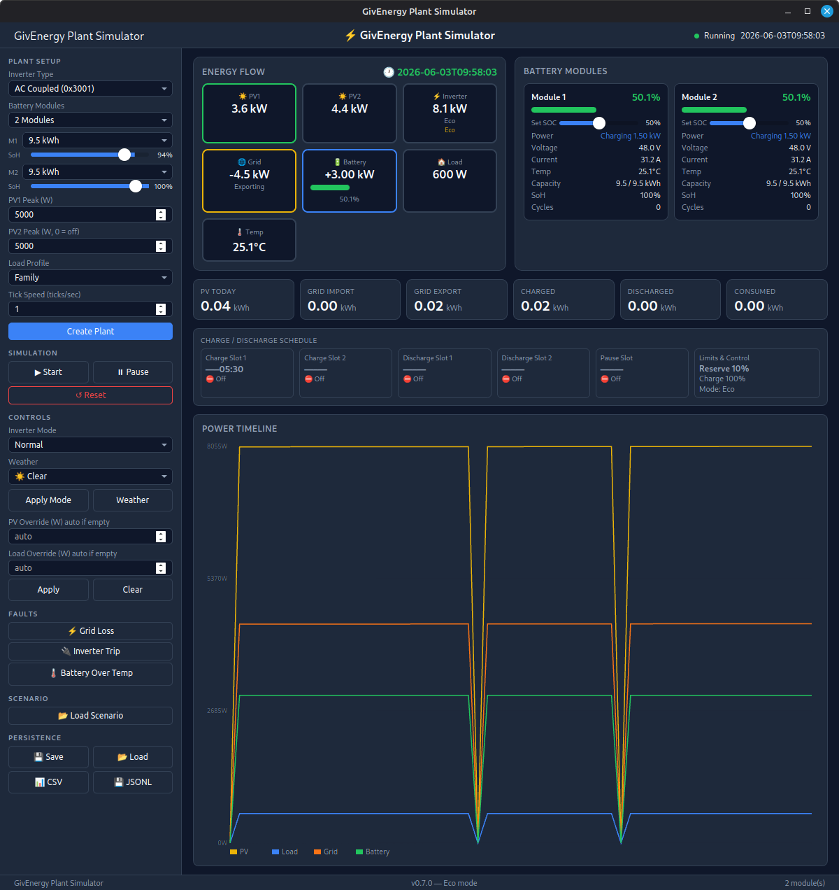

# GivEnergy Plant Simulator


> 🙏 **Huge thanks to the open-source reverse-engineering efforts that made this possible:**  
> [**GivTCP**](https://github.com/GivEnergy/giv_tcp) — the original GivEnergy Modbus integration for Home Assistant  
> [**givenergy-modbus**](https://github.com/dewet22/givenergy-modbus) — detailed register map, protocol reference, and Python library  

<div align="center">

<a href="https://www.buymeacoffee.com/psylsph" target="_blank"></a>

</div>

A digital twin of a GivEnergy solar PV + battery storage system. Model your Gen3 Hybrid or AC Coupled inverter with up to 3 battery modules, realistic solar generation, household load profiles, and Modbus integration — all running locally on your machine.

## Screenshot



## Features

- **Simulates a full GivEnergy plant** — inverter, batteries, solar PV, grid connection, and household load
- **Real-time dashboard** — energy flow diagram, battery SOC gauge, power timeline, cumulative kWh totals
- **Hardware-accurate Modbus protocol** — speaks the proprietary GivEnergy data-adapter framing, compatible with real client apps
- **12 inverter types** — Gen 1 Hybrid, Gen3 Hybrid (5/8/10 kW), AC Coupled (Mk1/Mk2), Three Phase, All-in-One (5/6/8/10 kW) with correct datasheet power limits
- **Dual PV arrays** — independent PV1 and PV2 with 45/55 power split
- **Up to 3 battery modules** — each with independent SOC, SOH, capacity, and thermal behaviour
- **5 inverter modes** — Normal, Eco, Force Charge, Force Discharge, Export Limit
- **Timed schedules** — charge/discharge windows with SOC targets, midnight-wrapping support
- **Manual overrides** — pin solar generation or load demand to fixed wattages for testing
- **Fault injection** — simulate grid loss, inverter trips, battery over-temperature
- **Weather simulation** — Clear, Partly Cloudy, Overcast, Rain, Storm irradiance profiles
- **Save and restore** — persist plant state to disk, reload with all settings intact
- **Headless CLI** — run scripted scenarios with assertions for automated testing

---

## Quick Start — Desktop GUI

```bash
# Install frontend dependencies (first time only)
cd ui && npm install && cd ..

# Launch the desktop app
cd crates/sim-tauri && cargo tauri dev
```

> **Prerequisites:** `cargo install tauri-cli` and on Linux: `sudo apt install libwebkit2gtk-4.1-dev`

## Quick Start — Headless CLI

```bash
# Run a built-in scenario
cargo run --bin sim-api -- run examples/basic_day.yaml

# With Modbus server (connect your GivEnergy client)
cargo run --bin sim-api -- run examples/basic_day.yaml --modbus 127.0.0.1:5020

# Multi-battery
cargo run --bin sim-api -- run examples/basic_day.yaml --battery-count 3

# Export results (JSON Lines, CSV, JUnit XML, JSON report)
cargo run --bin sim-api -- run examples/grid_outage.yaml --output /tmp/results
```

---

## Using the GUI

### Creating a Plant

1. **Choose an inverter type** from the dropdown — ordered by model series (Gen 1, Gen3, AC Coupled, Three Phase, All-in-One). Each type has correct AC and battery power limits from official datasheets.
2. **Set battery modules** — 1 to 3 modules. Select capacity for each (2.6–19.0 kWh).
3. **Adjust SOH** — the State of Health slider per module (50–100%). A 9.5 kWh module at 80% SOH behaves as 7.6 kWh.
4. **Set solar peak** — total peak solar capacity in watts. If you set PV2 peak, generation splits across two arrays (45% PV1 / 55% PV2).
5. **Pick a load profile** — Minimal, Family, EV, HeatPump, or Custom.
6. **Choose weather** — Clear, Partly Cloudy, Overcast, Rain, or Storm.
7. Click **Create Plant**. The simulation starts immediately.

### Dashboard

The main display shows:

- **Energy flow diagram** — animated power flows between Solar, Battery, Grid, and Load with live wattage labels.
- **Battery SOC gauge** — colour-coded charge level for each module.
- **Power timeline** — scrolling chart of solar, load, battery, and grid power over time.
- **Cumulative kWh cards** — total import, export, solar generation, consumption, charge, and discharge.

### Controlling the Simulation

| Control | What it does |
|---------|-------------|
| **Pause / Resume** | Freeze or unfreeze the simulation clock. |
| **Reset** | Destroy the current plant and return to the setup screen. |
| **Tick speed** | How fast simulated time advances (e.g. 1s real = 1min sim). |
| **Inverter mode** | Switch between Normal, Eco, Force Charge, Force Discharge, Export Limit at any time. |
| **Weather** | Change weather conditions on the fly — solar output adjusts immediately. |
| **Solar override** | Pin solar generation to a fixed wattage (works even at night). Set to 0 or clear to restore automatic. |
| **Load override** | Pin household demand to a fixed wattage. Set to 0 or clear to restore the load profile. |
| **Export limit** | Cap grid export in watts (used with Export Limit mode). |

### Schedules

Set timed charge or discharge windows:

- **Enable charge / discharge** — toggle the schedule on or off.
- **Start / End time** — use HH:MM format (e.g. `02:00` to `05:00` for a 3-hour window).
- **Target SOC** — charge target (e.g. charge to 100%) or discharge target (e.g. discharge to 10%).
- When active, the inverter mode automatically switches to Force Charge or Force Discharge during the window.

### Fault Injection

Click the fault buttons to inject failures:

- **Grid Loss** — disconnects the grid, no import or export possible.
- **Inverter Trip** — shuts down the inverter, all power flow stops.
- **Battery Over-Temp** — forces battery temperature above safe threshold, triggers derating then shutdown.

Click the corresponding **Clear** button to resolve the fault.

### Save and Load

- **Save** — writes the current plant state (all settings, SOC, energy totals, schedule config) to `~/.local/share/com.givenergy.simulator/plant_state.json`.
- **Load** — restores a previously saved plant. All sidebar controls (dropdowns, sliders, overrides) are restored to their saved values.

### Connecting a Modbus Client

The simulator speaks the real GivEnergy Modbus protocol. Any app that connects to a GivEnergy Wi-Fi dongle can connect to the simulator instead.

1. Start the simulator with the Modbus server enabled:
   ```bash
   cargo run --bin sim-api -- run examples/basic_day.yaml --modbus 127.0.0.1:5020
   ```
2. Point your GivEnergy client app at `127.0.0.1:5020`.
3. The client reads live registers (SOC, power, voltage, energy totals) and writes configuration (mode, schedules, SOC limits) just like a real inverter.

The server handles:
- **Read Input Registers** (fn 0x04, slave 0x32) — live readings
- **Read Holding Registers** (fn 0x03, slave 0x32) — configuration
- **Write Single Register** (fn 0x06, slave 0x11) — write commands that dispatch to the simulation engine
- **Battery BMS reads** (slave 0x33–0x37) — per-module battery details for multi-battery setups

---

## Using the CLI

### Running Scenarios

Scenarios are YAML files that describe a day (or multiple days) of simulated time with timed events and assertions:

```yaml
name: basic day
date: 2025-06-21
06:00:
  load: 800
12:00:
  expect:
    soc_gt: 70
    solar_gt: 3000
18:00:
  load: 3500
  expect:
    soc_lt: 80
```

Each time entry can set `load`, `solar`, `mode`, `weather`, `fault`, `clear_fault`, `export_limit`, and/or `expect` assertions.

### Available Assertions

| Assertion | Checks |
|-----------|--------|
| `soc_gt` / `soc_lt` | Battery SOC above/below a percentage |
| `solar_gt` / `solar_lt` | Solar generation above/below watts |
| `grid_connected` | Grid connected (1) or disconnected (0) |
| `grid_import_gt` | Grid import above watts |
| `grid_export_gt` | Grid export above watts |
| `battery_charging` | Battery is charging (true/false) |
| `no_faults` | No active faults |
| `fault_active` | Named fault is active |
| `solar_kwh_gt` | Cumulative solar generation above kWh |
| `grid_export_kwh_gt` | Cumulative grid export above kWh |
| `grid_import_kwh_gt` | Cumulative grid import above kWh |
| `load_kwh_gt` | Cumulative load consumption above kWh |

### Multi-Day Scenarios

Add `days: N` to repeat events daily. Events fire at the same time each day, with the simulation clock advancing through each day in sequence.

### Output Formats

When using `--output <dir>`, the CLI writes:

- **JSON Lines** — one frame per tick (`recording.jsonl`)
- **CSV** — energy trace (`trace.csv`)
- **JUnit XML** — assertion results for CI (`report.xml`)
- **JSON report** — summary with per-assertion pass/fail (`report.json`)

### CLI Flags

```
giv-sim run <scenario.yaml> [options]

Options:
  --date YYYY-MM-DD       Simulation start date (default: today)
  --battery-count N       Number of battery modules 1-3 (default: 1)
  --modbus ADDR:PORT      Start Modbus TCP server for client connections
  --output DIR            Write output files to directory
  --tick-interval MS      Real-time tick interval in milliseconds (default: 100)
```

---

## Inverter Types

All 12 supported inverter types with correct power limits:

| Inverter | Device Code | AC Max | Battery Limit |
|----------|-------------|--------|---------------|
| Gen 1 Hybrid | 0x1001 | 5,000W | 2,500W |
| Gen3 Hybrid | 0x2001 | 5,000W | 3,600W |
| Gen3 Hybrid 8kW | 0x2101 | 8,000W | 8,000W |
| Gen3 Hybrid 10kW | 0x2102 | 10,000W | 10,000W |
| AC Coupled | 0x3001 | 3,000W | 3,000W |
| AC Coupled Mk2 | 0x3002 | 3,000W | 3,000W |
| Three Phase | 0x4001 | 6,000W | 6,000W |
| All-in-One 6kW | 0x8001 | 6,000W | 6,000W |
| All-in-One | 0x8002 | 6,000W | 6,000W |
| All-in-One 5kW | 0x8003 | 5,000W | 5,000W |
| AIO 8kW | 0x8102 | 8,000W | 8,000W |
| AIO 10kW | 0x8103 | 10,000W | 10,000W |

Battery charge and discharge is capped by both the battery C-rate and the inverter's battery limit.

## Inverter Modes

| Mode | Behaviour |
|------|-----------|
| **Normal** | Solar powers load first, excess charges battery, remainder exports to grid. Deficit draws from battery, then grid. |
| **Eco** | Same as Normal — solar excess charges battery before export. |
| **Force Charge** | Grid charges battery at max rate until target SOC. Solar surplus assists. |
| **Force Discharge** | Battery discharges at max rate to grid/load. |
| **Export Limit** | Like Normal but caps grid export at a configurable wattage. |

## Load Profiles

| Profile | Description |
|---------|-------------|
| **Minimal** | Low baseline ~300W |
| **Family** | Morning peak, afternoon dip, evening peak ~3 kW |
| **EV** | Family + overnight EV charging |
| **HeatPump** | Family + steady heat pump load |
| **Custom** | Define your own `(hour, watts)` points |

## Battery Module Configuration

Select from standard GivEnergy module sizes: 2.6, 5.2, 7.0, 8.2, 9.5, 12.8, 16.0, 19.0 kWh. Each module's SOH slider adjusts effective capacity — a 9.5 kWh module at 80% SOH behaves as 7.6 kWh.

---

## Architecture

```
┌─────────────────────────────────────────────────────────┐
│  Tauri GUI (sim-tauri) / Headless CLI (sim-api)        │
├─────────────────────────────────────────────────────────┤
│  → Scenario Parser (sim-scenarios)                      │
│  → SimulationEngine (sim-core)                          │
│      → Solar → Load → Inverter → Faults → Battery → ET  │
│  → RegisterStore (sim-registers)                        │
│  → Modbus TCP Server (sim-modbus)                       │
│  → Recording (sim-recording, sim-storage)               │
└─────────────────────────────────────────────────────────┘
```

Full architecture diagram: [`docs/architecture-diagram.md`](docs/architecture-diagram.md)

The engine runs a deterministic tick loop. Each tick advances the simulation clock and processes all device models in a fixed order:

```
Schedule → Solar → Load → Inverter → Faults → Battery → Energy Tracker
```

### Battery Model

Each battery module tracks:

- **SOC** (state of charge) — percentage, clamped to configurable min/max
- **SOH** (state of health) — degrades with charge cycles, reduces effective capacity
- **Temperature** — rises during charge/discharge, passive cooling towards ambient, derates above 45°C, shuts down above 55°C
- **Efficiency** — configurable charge/discharge efficiency (default 95%)
- **Power limits** — C-rate based, capped by inverter DC power rating

Power is distributed evenly across modules. The inverter's `max_ac_watts` caps the total charge or discharge rate regardless of battery capability.

### Modbus Protocol

The simulator implements the GivEnergy proprietary Modbus framing — not standard Modbus TCP. The Wi-Fi dongle wraps all frames in an envelope with transaction ID `0x5959`, a 10-byte inverter serial, and inner CRC-16. This means real GivEnergy monitoring apps can connect directly.

Register map covers:

- **Input registers** (0–59): live readings — PV voltage/current/power, grid power, battery SOC/voltage/current/temperature, energy totals
- **Holding registers** (0–320): configuration — inverter mode, charge/discharge slots, SOC limits, battery pause mode
- **Internal registers** (100–705): extended simulator state — per-module battery details, PV parameters, grid stats, energy totals, schedule config

---

## Project Structure

```
crates/
  sim-models/     — DeviceModel trait, PlantState, all sub-state types
  sim-core/       — SimulationEngine, Command enum, device model implementations
  sim-registers/  — RegisterDef catalogue, RegisterStore, state-to-register projection
  sim-modbus/     — GivEnergy proprietary Modbus TCP server
  sim-scenarios/  — YAML DSL parser with assertion checking
  sim-faults/     — Fault definitions and FaultEngine
  sim-recording/  — JSON Lines recording, CSV, JUnit XML, JSON report export
  sim-storage/    — File I/O for recordings
  sim-api/        — Headless CLI binary
  sim-tauri/      — Tauri v2 desktop GUI
ui/               — Web frontend (Vite + vanilla JS)
```

## Building and Testing

```bash
# Run the full test suite (211 tests)
cargo test

# Build everything (except sim-tauri which needs GTK deps)
cargo build --workspace --exclude sim-tauri

# Run a single test
cargo test -p sim-core -- battery_balancing

# Lint
cargo fmt --all -- --check
cargo clippy --all-targets --workspace --exclude sim-tauri
```

## Design Documents

Full design docs live in [`docs/`](docs/) — architecture, state model, register strategy, Modbus protocol, IPC contracts, engine designs, and roadmap.

## Credits

This project would not exist without the pioneering reverse-engineering work of the GivEnergy open-source community.

- **[GivTCP](https://github.com/GivEnergy/giv_tcp)** — The original GivEnergy Modbus integration for Home Assistant. This project established the core Modbus protocol mapping, register addresses, and write methodology that this app builds on. Without GivTCP, none of this would be possible.

- **[givenergy-modbus](https://github.com/dewet22/givenergy-modbus)** — The definitive Python reference library for the GivEnergy Modbus protocol. Its detailed register map, frame format documentation, and working reference implementation were invaluable in getting the protocol right — especially the write protocol (function code 6, device address 0x11) and the HHMM timeslot encoding.

Both projects are open-source and available on GitHub. If you find this app useful, consider giving them a star too ⭐

## License

MIT
