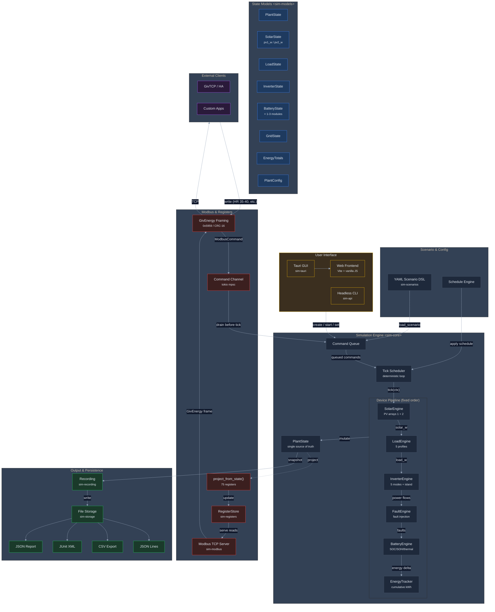

# Architecture Diagram

```mermaid
%%{init: {'theme': 'base', 'themeVariables': { 'primaryColor': '#1e293b', 'primaryTextColor': '#e2e8f0', 'primaryBorderColor': '#475569', 'lineColor': '#94a3b8', 'secondaryColor': '#0f172a', 'tertiaryColor': '#334155' }}}%%
graph TB
    %% ── User Interface Layer ──
    subgraph UI["User Interface"]
        Tauri["Tauri GUI<br/><small>sim-tauri</small>"]
        CLI["Headless CLI<br/><small>sim-api</small>"]
        WebUI["Web Frontend<br/><small>Vite + vanilla JS</small>"]
        Tauri --> WebUI
    end

    %% ── Scenario Layer ──
    subgraph Scenario["Scenario & Config"]
        YAML["YAML Scenario DSL<br/><small>sim-scenarios</small>"]
        Schedule["Schedule Engine"]
    end

    %% ── Core Simulation Layer ──
    subgraph Engine["Simulation Engine &lt;sim-core&gt;"]
        direction TB
        TickLoop["Tick Scheduler<br/><small>deterministic loop</small>"]
        
        subgraph Devices["Device Pipeline (fixed order)"]
            SE["SolarEngine<br/><small>PV arrays 1 + 2</small>"]
            LE["LoadEngine<br/><small>5 profiles</small>"]
            IE["InverterEngine<br/><small>5 modes + island</small>"]
            FE["FaultEngine<br/><small>fault injection</small>"]
            BE["BatteryEngine<br/><small>SOC/SOH/thermal</small>"]
            ET["EnergyTracker<br/><small>cumulative kWh</small>"]
        end
        
        State["PlantState<br/><small>single source of truth</small>"]
        CmdQ["Command Queue"]
    end

    %% ── State Model Layer ──
    subgraph Models["State Models &lt;sim-models&gt;"]
        PS["PlantState"]
        SC["SolarState<br/><small>pv1_w / pv2_w</small>"]
        LC["LoadState"]
        IC["InverterState"]
        BC["BatteryState<br/><small>× 1-3 modules</small>"]
        GC["GridState"]
        EC["EnergyTotals"]
        Config["PlantConfig"]
    end

    %% ── Register & Modbus Layer ──
    subgraph Modbus["Modbus & Registers"]
        RS["RegisterStore<br/><small>sim-registers</small>"]
        RegProj["project_from_state()<br/><small>75 registers</small>"]
        ModbusSrv["Modbus TCP Server<br/><small>sim-modbus</small>"]
        GivFrame["GivEnergy Framing<br/><small>0x5959 / CRC-16</small>"]
        MBChan["Command Channel<br/><small>tokio mpsc</small>"]
    end

    %% ── Output Layer ──
    subgraph Output["Output & Persistence"]
        Rec["Recording<br/><small>sim-recording</small>"]
        Store["File Storage<br/><small>sim-storage</small>"]
        JSONL["JSON Lines"]
        CSV["CSV Export"]
        JUnit["JUnit XML"]
        JSONR["JSON Report"]
    end

    subgraph Clients["External Clients"]
        GivTCP["GivTCP / HA"]
        Custom["Custom Apps"]
    end

    %% ── Connections ──
    UI -->|"create / start / set"| CmdQ
    CmdQ -->|"queued commands"| TickLoop
    YAML -->|"load_scenario"| CmdQ
    Schedule -->|"apply schedule"| TickLoop
    
    TickLoop -->|"tick(ctx)"| SE
    SE -->|"solar_w"| LE
    LE -->|"load_w"| IE
    IE -->|"power flows"| FE
    FE -->|"faults"| BE
    BE -->|"energy delta"| ET
    
    Devices -->|"mutate"| State
    State -.->|"project"| RegProj
    RegProj -->|"update"| RS
    RS -->|"serve reads"| ModbusSrv
    ModbusSrv -->|"GivEnergy frame"| GivFrame
    GivFrame -->|"TCP"| Clients
    Clients -->|"write (HR 35-40, etc.)"| GivFrame
    GivFrame -->|"ModbusCommand"| MBChan
    MBChan -->|"drain before tick"| CmdQ

    State -->|"snapshot"| Rec
    Rec -->|"write"| Store
    Store --> JSONL
    Store --> CSV
    Store --> JUnit
    Store --> JSONR

    %% ── Styling ──
    classDef model fill:#1e3a5f,stroke:#3b82f6,color:#e2e8f0
    classDef engine fill:#1e293b,stroke:#475569,color:#e2e8f0
    classDef modbus fill:#3b1f1f,stroke:#ef4444,color:#e2e8f0
    classDef output fill:#1a3a2a,stroke:#22c55e,color:#e2e8f0
    classDef ui fill:#3b2f1f,stroke:#eab308,color:#e2e8f0
    classDef client fill:#2a1a3a,stroke:#a855f7,color:#e2e8f0

    class PS,SC,LC,IC,BC,GC,EC,Config model
    class SE,LE,IE,FE,BE,ET,State,CmdQ,TickLoop engine
    class RS,RegProj,ModbusSrv,GivFrame,MBChan modbus
    class Rec,Store,JSONL,CSV,JUnit,JSONR output
    class Tauri,CLI,WebUI,UI ui
    class GivTCP,Custom client
```
